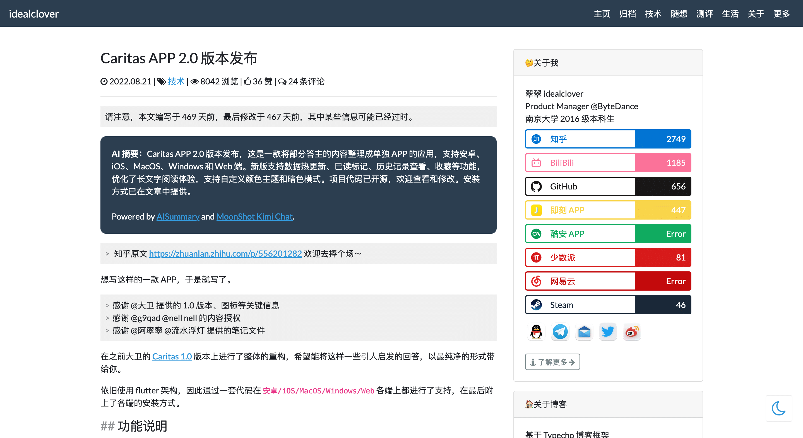
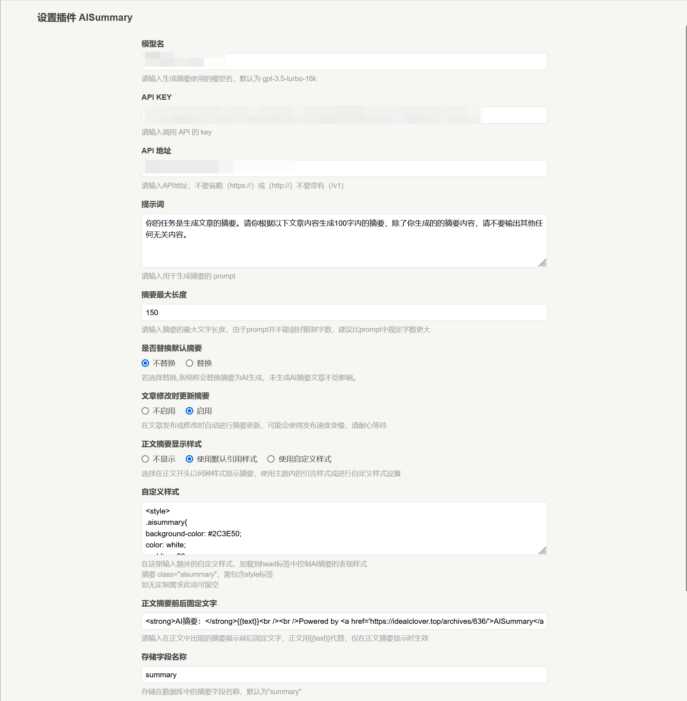
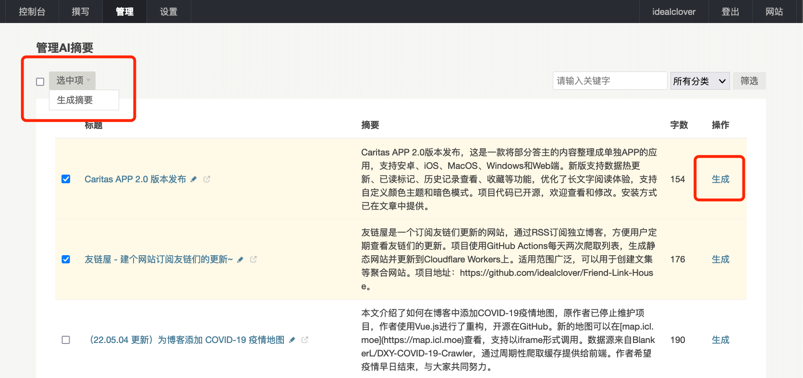

# AISummary-Typecho

> 🤖📝 懒得更新了 GPT 快救一下啊！

用 AI 能力为 Typecho 文章生成摘要！

[博客文章详细介绍](https://idealclover.top/archives/636/)

## Feature

- 支持 ChatGPT 与相似 API 调用方式的 AI 模型（如 Moonshot Kimi）
- 丰富的自定义功能
  - 自定义提示词 prompt
  - 自定义替换方式（替换默认摘要/加在正文前面）
  - 自定义存储字段，多模型多摘要共存
  - 自定义展示前后缀与样式
- AI 摘要管理面板，一键生成多篇文章摘要

详细说明见 [博客文章](https://idealclover.top/archives/636/)

## 安装方式

1. Clone 这个仓库或[下载 zip](https://github.com/idealclover/AISummary-Typecho/releases/download/v1.0.0/AISummary.zip)到 {typecho 目录}/usr/plugins
2. 重命名为 AISummary（区分大小写）
3. 在管理平台中启用插件
4. 点击设置配置 API 地址与 API KEY 等信息
5. 在`管理-摘要`中查看与生成文章摘要

## 参考项目

- 核心能力参考 [Rockytkg/AIContentSummary](https://github.com/Rockytkg/AIContentSummary)
- 自定义页面能力参考 [visamz/CommentToMail](https://github.com/visamz/CommentToMail)
- 获取文章能力参考 [manage-posts.php](https://github.com/typecho/typecho/blob/master/admin/manage-posts.php)
